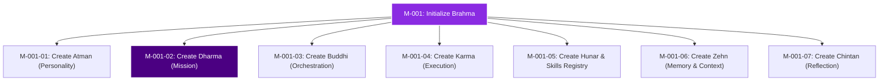

# Dharma: The Mission Engine

```yaml
id: DHARMA
version: 1.0.0
last_sync: 2026-05-30T23:57:42+05:30
active_mission_id: M-001
mission_status: IN_PROGRESS
overall_progress: 0%
agent_permission: READ-WRITE
description: "Governs strategic target definition, task decomposition, and milestone compliance."
```

---

## 1. Active Mission Board

### High-Level Directive
**Mission ID**: `M-001`  
**Title**: "Initialize Brahma Core Brain & Setup Environment"  
**Objective**: Build a premium, structured, and self-updating architectural brain file-system consisting of the Atman, Dharma, Buddhi, Karma, Hunar, Zehn, and Chintan engines, enabling sustainable agentic workflows and token-efficient execution.



---

## 2. Decomposed Sub-Mission Ledger

This ledger lists the sub-tasks required to achieve the active mission. Agents (governed by **Buddhi**) will assign, execute, and update these records.

| Sub-Task ID | Title / Description | Dependency | Assigned To | Status | Progress |
| :--- | :--- | :---: | :---: | :---: | :---: |
| **M-001-01** | Create `Atman.md` (Directness & Personality Engine) | None | System Agent | **COMPLETED** | `100%` |
| **M-001-02** | Create `Dharma.md` (Strategic Target & Task ledger) | M-001-01 | System Agent | **IN-PROGRESS**| `50%` |
| **M-001-03** | Create `Buddhi.md` (Mastermind Strategic Planner) | M-001-02 | System Agent | **PENDING** | `0%` |
| **M-001-04** | Create `Karma.md` (Execution Logs & Action Engine) | M-001-03 | System Agent | **PENDING** | `0%` |
| **M-001-05** | Create `Hunar.md` (Skill Registry & folder structure) | M-001-04 | System Agent | **PENDING** | `0%` |
| **M-001-06** | Create `Zehn.md` (Structured Context, Entity Map, Decay) | M-001-05 | System Agent | **PENDING** | `0%` |
| **M-001-07** | Create `Chintan.md` (Reflection & optimization loops) | M-001-06 | System Agent | **PENDING** | `0%` |

---

## 3. Historical Missions Index
*Compact database of completed high-level objectives.*

| Mission ID | Title / Target Description | End Date | Final Outcome | Learning Summary Link |
| :--- | :--- | :---: | :---: | :--- |
| **M-000** | Initial Workspace Directory Auditing & Schema Mapping. | 2026-05-30 | **SUCCESS** | [Chintan.md#M-000](file:///h:/Brahma/Brahma%20%5BBrain%5D/Chintan.md#M-000) |

---

## 4. Agent Protocol (Self-Update Instructions)

### When to update this file:
- **Intake**: When the user provides a new core goal, archive the previous `Active Mission Board` into the `Historical Missions Index` and generate a new `M-XXX` index.
- **Decomposition**: Analyze the high-level mission and break it down into clean, logically sequenced sub-tasks starting from `M-XXX-01` to `M-XXX-NN`.
- **Status Updates**: After execution of any action by **Karma**, update the corresponding Sub-Task `Status`, `Progress`, and modify the global `overall_progress` in the metadata YAML.

### Safe Edit Guidelines:
1. **Never erase old missions**: Archive them in the historical ledger.
2. **Sub-Task Formats**: Keep titles short and descriptions focused. Do not add conversational text here.
3. **Status Enums**: Strictly use: `PENDING`, `IN-PROGRESS`, `COMPLETED`, `FAILED`, or `BLOCKED`.
