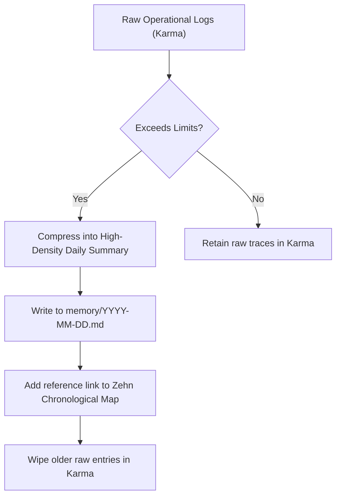

# Zehn: The Context Engine

```yaml
id: ZEHN
version: 1.0.0
last_sync: 2026-05-30T23:57:42+05:30
indexed_entities_count: 9
chronological_sessions_count: 1
memory_decay_status: NOMINAL
agent_permission: READ-WRITE
description: "Relational entity database, chronological session indexes, memory decay triggers, and context mappings."
```

---

## 1. High-Density Entity Index (EI)

This database indexes entities, technologies, directories, and structural assets across the workspace. Referencing these IDs saves tokens in agent execution prompts.

| Entity ID | Entity Name | Category | Scope / Definition | Relationships & Dependencies |
| :--- | :--- | :---: | :--- | :--- |
| **E-001** | `Brahma` | Framework | Self-evolving AI core agentic architecture. | Parent of Atman, Dharma, Buddhi, Karma, Hunar, Zehn, Chintan. |
| **E-002** | `Atman` | Engine | Core personality, directness traits, advisory engine. | Dictates execution behavior of `Karma` and planning of `Buddhi`. |
| **E-003** | `Dharma` | Engine | Mission ledger, sub-task breakdowns, milestone compliance. | Feeds active target goals into `Buddhi`. |
| **E-004** | `Buddhi` | Engine | Planner mastermind, risk mitigations, agent routing. | Orchestrates `Karma` tools and registers capabilities in `Hunar`. |
| **E-005** | `Karma` | Engine | Action logging tracker, operational sync, tool execution. | Operational arm; stores raw traces for archival into `memory/`. |

*<!-- DYNAMIC_ENTITY_INSERTION_MARKER -->
| **E-006** | `Yuvraj Mishra.` | User | Primary user and system operator. Specializes in full-stack engineering and UI/UX design. | Commands and trains Brahma; controls server. |
| **E-007** | `skills/discord` | Directory | Contains Discord administrative capability sheets. | Loaded by Hunar; executed by DiscordService. |
| **E-008** | `skills/brahma` | Directory | Contains Brahma strategic orchestration skill sheets. | Loaded by Hunar; executed by OrchestratorService. |
| **E-009** | `Hunar.md` | File | Master capability registry listing all operational skills. | Maintained by Brahma; dictates operational capabilities. |
*
*New terms, user concepts, and files are indexed here by agents.*

---

## 2. Chronological Session Index (CSI)

Unified registry mapping daily workflows and active context files located in `memory/`.

| Session Date | Context ID | Focus / Major Action | Path / File Link | Token-Footprint Weight |
| :--- | :---: | :--- | :--- | :---: |
| **2026-05-30** | `C-001` | Brahma Architecture setup & core engines deployment. | [2026-05-30.md](file:///h:/Brahma/Brahma%20%5BBrain%5D/memory/2026-05-30.md) | `LOW (~1.5k)` |

<!-- DYNAMIC_SESSION_INSERTION_MARKER -->
| **2026-05-31** | `C-189` | Conversational memory sync between AutonomousUser and Brahma. | [2026-05-31.md](file:///h:/Brahma/Brahma%20%5BBrain%5D/memory/2026-05-31.md) | LOW (~1.0k) |

| **2026-05-31** | `C-453` | Conversational memory sync between AutonomousUser and Brahma. | [2026-05-31.md](file:///h:/Brahma/Brahma%20%5BBrain%5D/memory/2026-05-31.md) | LOW (~1.0k) |

| **2026-05-31** | `C-876` | Conversational memory sync between AutonomousUser and Brahma. | [2026-05-31.md](file:///h:/Brahma/Brahma%20%5BBrain%5D/memory/2026-05-31.md) | LOW (~1.0k) |

| **2026-05-31** | `C-571` | Conversational memory sync between _.yuvraj.mishra._ and Brahma. | [2026-05-31.md](file:///h:/Brahma/Brahma%20%5BBrain%5D/memory/2026-05-31.md) | LOW (~1.0k) |

---

## 3. System Memory Decay & Pruning Policy

To optimize token efficiency during long-term operations, agents must implement this context decay protocol:



### A. Retention Metrics
- **Short-Term Context (Karma)**: Retained for active session debug loop (Max 20 raw atomic logs).
- **Relational Context (Zehn)**: Permanent entity registrations, continuously modified by the reflection engine to resolve drift.
- **Long-Term Memory (Memory Folder)**: Archived daily logs, accessed ONLY when historical context or past configurations are explicitly queried by the user.

---

## 4. Agent Protocol (Self-Update Instructions)

### When to update this file:
- **Entity Identification**: When the user introduces a new project definition, file, library, or recurring preference, assign it an ID (`E-XXX`) and insert it in the **Entity Index**.
- **Session Turnaround**: At the end of a session or calendar day, compile the day's compressed logs, generate `memory/YYYY-MM-DD.md`, and log the session in the **Chronological Session Index**.

### Safe Edit Guidelines:
1. **Uniqueness**: Never duplicate entity names or IDs.
2. **Conciseness**: Summarize scope and relationships in a single sentence. Keep cell sizes compact.
3. **Decay Compliance**: Never allow `Karma` logs to exceed threshold without triggering the decay and archival actions outlined in this protocol.
