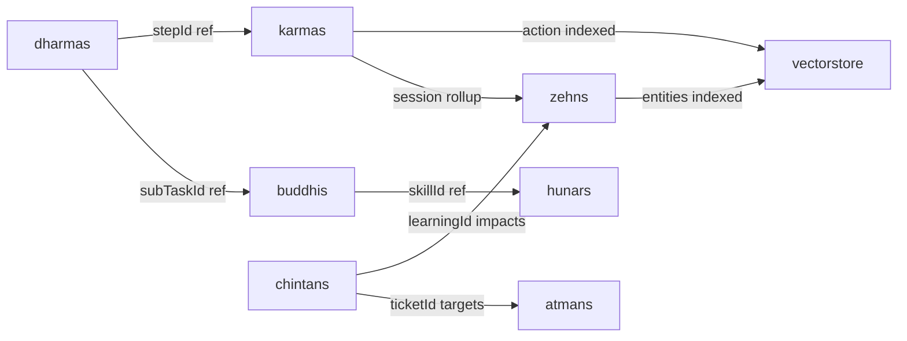

# Brahma Database Schema Reference

```yaml
id: DB_SCHEMA
version: 1.0.0
last_sync: 2026-05-31T13:44:41+05:30
database: MongoDB
orm: Mongoose 9.x
agent_permission: READ-ONLY
description: "Complete schema definitions, field types, constraints, and relationships for all Brahma collections."
```

---

## Collection Map

```
brahma (database)
├── atmans          ← Personality engine state
├── dharmas         ← Mission board + sub-task ledger
├── buddhis         ← Strategic plans + cognitive decisions
├── karmas          ← Live execution action register
├── hunars          ← Skill registry entries
├── zehns           ← Entity index + session history map
├── chintans        ← Reflection learnings + optimization tickets
└── vectorstore     ← Dense embedding chunks for RAG retrieval
```

---

## 1. `atmans` — Atman (Personality Engine)

```typescript
{
  version: string            // Semver e.g. "1.0.0"
  lastSync: Date
  directness: 1 | 2 | 3 | 4 | 5         // How concise responses are
  philosophicalDepth: 1 | 2 | 3 | 4 | 5 // Depth of philosophical engagement
  advisoryProactivity: 1 | 2 | 3 | 4 | 5// How often unsolicited advice is given
  humanEmpathy: 1 | 2 | 3 | 4 | 5       // Emotional warmth in responses
  userAlignments: [
    {
      preferenceId: string    // e.g. "U-PREF-001"
      observedPreference: string
      adaptationRequired: string
      confidenceScore: number  // 0–100
    }
  ]
}
```

---

## 2. `dharmas` — Dharma (Mission Engine)

```typescript
{
  version: string
  lastSync: Date
  missionId: string           // UNIQUE. e.g. "M-001"
  title: string
  objective: string
  status: 'PENDING' | 'IN_PROGRESS' | 'COMPLETED' | 'FAILED'
  overallProgress: number     // 0–100
  subTasks: [
    {
      subTaskId: string       // e.g. "M-001-01"
      title: string
      description: string
      dependency: string | null  // subTaskId of prerequisite
      assignedTo: string
      status: 'PENDING' | 'IN_PROGRESS' | 'COMPLETED' | 'FAILED' | 'BLOCKED'
      progress: number        // 0–100
    }
  ]
}
```

**Indexes:** `missionId` (unique)

---

## 3. `buddhis` — Buddhi (Strategic Planner)

```typescript
{
  version: string
  lastSync: Date
  strategyMode: string         // e.g. "HIGH_EFFICIENCY"
  orchestrationCycle: string   // e.g. "ACTIVE"
  risks: [
    {
      targetSubTaskId: string
      strategyRoute: string
      associatedRisks: string
      mitigationPolicy: string
      priority: 'CRITICAL' | 'HIGH' | 'MEDIUM' | 'LOW'
    }
  ]
  orchestration: [
    {
      subTaskId: string
      primaryExecutor: string
      requiredSkillSet: string
      operationalConstraints: string
      targetOutputs: string
    }
  ]
  cognitiveDecisions: [
    {
      decisionId: string      // UNIQUE. e.g. "D-001"
      context: string
      evaluatedAlternatives: string
      selectedPathAndRationale: string
    }
  ]
}
```

---

## 4. `karmas` — Karma (Execution Engine)

```typescript
{
  version: string
  lastSync: Date
  executionStatus: string      // e.g. "IDLE" | "RUNNING"
  executedActionsCount: number
  liveActions: [
    {
      stepId: string           // UNIQUE. e.g. "K-001"
      taskRef: string          // References Dharma subTaskId
      toolExecuted: string
      intendedPurpose: string
      resultSummary: string    // ≤ 15 words
      outcome: 'SUCCESS' | 'WARNING' | 'FAILED'
    }
  ]
  workspaceState: [
    {
      checkTarget: string
      verificationMetric: string
      currentStatus: string
      observationNotes: string
    }
  ]
}
```

> [!WARNING]
> When `liveActions.length >= 20`, trigger the archival protocol: compress entries into `memory/`, update Zehn, call `VectorService.upsertChunk()`, then truncate to last 5 entries.

---

## 5. `hunars` — Hunar (Skill Registry)

Each document represents one discrete skill/capability.

```typescript
{
  skillId: string       // UNIQUE. e.g. "S-001"
  category: string      // e.g. "System" | "Coding" | "Research" | "Custom"
  name: string
  status: 'ACTIVE' | 'DEPRECATED'
  description: string
  fileLink: string      // Relative path to skill markdown file
  createdOn: Date
  lastModified: Date
}
```

---

## 6. `zehns` — Zehn (Context Engine)

```typescript
{
  version: string
  lastSync: Date
  indexedEntitiesCount: number
  chronologicalSessionsCount: number
  memoryDecayStatus: 'NOMINAL' | 'COMPRESSING' | 'DEGRADED'
  entities: [
    {
      entityId: string      // UNIQUE. e.g. "E-001"
      name: string
      category: string
      scope: string
      relationships: string
    }
  ]
  sessions: [
    {
      sessionId: string     // UNIQUE. e.g. "C-001"
      date: Date
      focus: string
      fileLink: string      // Path to memory/YYYY-MM-DD.md
      tokenWeight: string   // e.g. "LOW (~1.5k)"
    }
  ]
}
```

---

## 7. `chintans` — Chintan (Reflection Engine)

```typescript
{
  version: string
  lastSync: Date
  reflectionsCompleted: number
  learningsCaptured: number
  activeTicketsCount: number
  learnings: [
    {
      learningId: string    // UNIQUE. e.g. "L-001"
      sourceEngine: string
      observation: string
      extractedPrinciple: string
      targetFileImpact: string
    }
  ]
  tickets: [
    {
      ticketId: string      // UNIQUE. e.g. "T-001"
      targetFile: string
      coreRefinementRequired: string
      verificationSuccessCriteria: string
      status: 'PENDING' | 'RESOLVED'
    }
  ]
  retrospectives: [
    {
      reviewDate: Date
      targetMission: string
      auditedErrors: string
      structuralOptimizationMade: string
    }
  ]
}
```

---

## 8. `vectorstore` — VectorStore (RAG Embedding Chunks)

```typescript
{
  docId: string           // Source reference e.g. "E-001", "C-001", "S-003"
  docType: 'entity' | 'session' | 'skill' | 'memory' | 'mission' | 'generic'
  content: string         // Original text chunk (the text that was embedded)
  contentHash: string     // UNIQUE. SHA-256. Prevents re-embedding unchanged content.
  embedding: number[]     // Dense float32 vector (384-dim MiniLM or 1536-dim API)
  embeddingDim: number    // Vector dimension
  metadata: object        // Arbitrary extra fields (tags, timestamps, etc.)
  createdAt: Date
  updatedAt: Date
}
```

**Indexes:**
- `{ docId: 1, docType: 1 }` — fast lookups by source
- `{ contentHash: 1 }` — unique, prevents duplicates

**Retrieval methods:** cosine similarity (semantic) + BM25 (keyword) fused via Reciprocal Rank Fusion.

---

## Cross-Collection Relationships


