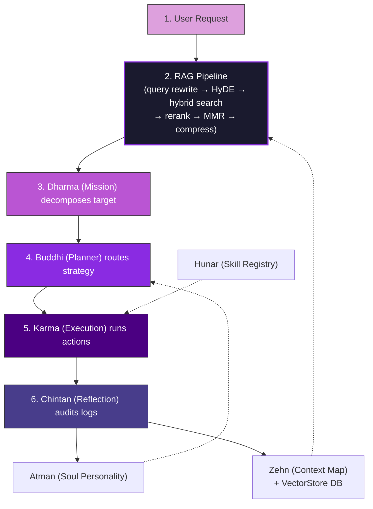

# Brahma Core System & Execution Workflow

```yaml
id: WORKFLOW
version: 2.0.0
last_sync: 2026-05-31T13:44:41+05:30
agent_permission: READ-ONLY
description: "Core execution cycle, RAG pipeline, database layer, token-saving strategies, and multi-agent coordination."
```

---

## 1. The Core System Architecture ("The Brahma Loop")

Brahma is a **closed-loop agentic intelligence framework**. Cognitive functions are distributed across specialized engines, a database layer, and a full advanced RAG retrieval stack. No single large prompt; instead, lightweight, purpose-scoped context is injected at each stage.



---

## 2. Technology & Services Stack

```
h:\Brahma\backend\
├── models/                      ← MongoDB / Mongoose layer
│   ├── Atman.ts                 # Personality sliders + user alignment prefs
│   ├── Dharma.ts                # Mission board + sub-task ledger
│   ├── Buddhi.ts                # Strategy routes + cognitive decisions
│   ├── Karma.ts                 # Live action register + workspace state
│   ├── Hunar.ts                 # Skill registry index
│   ├── Zehn.ts                  # Entity index + session map
│   ├── Chintan.ts               # Learnings + optimization tickets
│   └── VectorStore.ts           # Dense embedding chunks for RAG retrieval
│
└── services/                    ← Business logic layer
    ├── db.service.ts             # MongoDB connection (singleton + auto-retry)
    ├── llm.service.ts            # Generic OpenAI-compatible LLM interface
    ├── embedding.service.ts      # Text → vector (API + local MiniLM fallback)
    ├── vector.service.ts         # Hybrid search (cosine + BM25 + RRF)
    ├── rag.service.ts            # 8-stage Advanced RAG pipeline
    ├── context.service.ts        # ID-based + RAG-based context hydration
    └── orchestrator.service.ts   # Buddhi loop: decompose → execute → complete
```

---

## 3. The Advanced RAG Pipeline (Stage 2 Detail)

Before any planning or execution, every complex user query passes through the 8-stage retrieval pipeline to produce a **compressed, diverse, token-budgeted context block**.

```
Raw Query
  │
  ├─[1] Query Rewriting ──── LLM sharpens intent, removes ambiguity
  ├─[2] Multi-Query Expand ── 3 semantic variants generated
  ├─[3] HyDE ─────────────── LLM writes hypothetical ideal answer → embed that
  ├─[4] Batch Embedding ───── All variants embedded in one API call (LRU cached)
  ├─[5] Hybrid Retrieval ──── Cosine similarity + BM25 per variant → RRF fusion
  ├─[6] LLM Reranking ─────── Score each chunk 1-10 for relevance (20 → 10)
  ├─[7] MMR Deduplication ─── Maximum Marginal Relevance: diverse selection (10 → 5)
  └─[8] Contextual Compress ── Extract only query-relevant sentences (~1500 tokens)
         │
         ▼
    contextBlock  ──→  injected into system prompt  ──→  LLM  ──→  Response
```

### RAG Configuration Defaults

| Parameter | Default | Description |
| :--- | :---: | :--- |
| `retrievalTopK` | `20` | Chunks fetched per query variant |
| `rerankTopK` | `10` | Chunks kept after LLM reranking |
| `finalTopK` | `5` | Chunks kept after MMR |
| `mmrLambda` | `0.5` | Relevance vs diversity balance |
| `maxTokenBudget` | `1500` | Hard cap on final context size |

---

## 4. Phase-by-Phase Execution Pipeline

### Phase A: Strategic Synthesis (Planning)
1. **RAG Hydration**: `ContextService.retrieveContext(query)` runs the full RAG pipeline against the `VectorStore`, returning a compressed context block from Zehn entities + memory logs.
2. **Intake**: The **Planner Agent** receives the context and user goal, generating a new Mission ID (`M-XXX`) in `Dharma`.
3. **Decomposition**: `OrchestratorService.decomposeMission()` calls the LLM with the hydrated context. The LLM returns structured JSON sub-tasks, automatically saved to the `Dharma` MongoDB collection.
4. **Strategy Mapping**: `Buddhi` logs routing strategies, risk mitigations, and assigns Skill IDs (`S-XXX`) from the `Hunar` registry.

### Phase B: Tactical Execution (Action)
1. **Dispatch**: `OrchestratorService.executeNextTask()` promotes the next `PENDING` sub-task to `IN_PROGRESS`.
2. **Skill Execution**: The Executor runs the appropriate skill procedure from the `skills/` directory.
3. **Trace Log**: Results are logged as `K-XXX` rows in the `Karma` MongoDB collection.

### Phase C: Cognitive Integration (Reflection & Decay)
1. **Self-Audit**: `Chintan` compares `Karma` action traces against `Dharma` sub-tasks.
2. **Learnings**: Successes/failures are stored as `L-XXX` entries in `Chintan`.
3. **Behavioral Update**: Personality sliders in `Atman` are adjusted; tickets `T-XXX` are issued.
4. **Vector Re-index**: Newly created entities or memory logs are upserted into `VectorStore` via `VectorService.upsertChunk()`.
5. **Decay & Rollup**: When `Karma` logs exceed 20 entries, they are compressed into `memory/YYYY-MM-DD.md` and re-indexed.

---

## 5. Token-Efficiency Strategy

### Context Loading Rules (Non-RAG path)

| Query Type | Files / Collections to Load | Skip | Rationale |
| :--- | :--- | :--- | :--- |
| **New Goal** | `Dharma` | `Karma`, `skills/`, `memory/` | Planner only needs mission state |
| **Task Planning** | `Dharma`, `Buddhi`, `Zehn` | `Atman`, `Chintan` | Strategy needs context maps, not personality |
| **Execution** | `Buddhi`, `Karma`, `Hunar` | `Chintan`, `memory/` | Executor needs plans + skill specs |
| **Reflection** | `Dharma`, `Karma`, `Chintan` | `Hunar`, `skills/` | Auditor compares planned vs actual |
| **Complex Query** | `RAG Pipeline` (full) | All raw files | RAG compresses all knowledge into ~1500 tokens |

### The Alphanumeric Index Constraint
> [!TIP]
> Reference by ID, never by verbose description. Instead of re-explaining an entity, instruct agents:
> *"Use Entity `E-002` (Atman), Skill `S-001`, for sub-task `M-001-03`."*
> Saves up to **75%** of prompt token overhead.

### RAG Token Savings
> [!TIP]
> The full Zehn entity database + memory logs can easily exceed 50,000 tokens. The RAG pipeline compresses the **relevant subset** to a hard cap of **1,500 tokens** with higher accuracy than loading all files manually.

---

## 6. Multi-Agent Orchestration (Parallel Execution)

```
┌──────────────────────────────────────────────┐
│            RAG / CONTEXT AGENT               │
│  Reads: VectorStore, Zehn                    │
│  Writes: (stateless — returns context block) │
└───────────────────────┬──────────────────────┘
                        │
                        ▼
┌──────────────────────────────────────────────┐
│              PLANNER AGENT                   │
│  Reads: Dharma, contextBlock (from RAG)      │
│  Writes: Dharma, Buddhi                      │
└───────────────────────┬──────────────────────┘
                        │
                        ▼
┌──────────────────────────────────────────────┐
│              EXECUTOR AGENT                  │
│  Reads: Buddhi, Hunar   Writes: Karma        │
└───────────────────────┬──────────────────────┘
                        │
                        ▼
┌──────────────────────────────────────────────┐
│             REFLECTION AGENT                 │
│  Reads: Karma, Dharma  Writes: Chintan, Zehn │
│                        Triggers: upsertChunk │
└──────────────────────────────────────────────┘
```

Each agent operates on a **distinct write scope** — no file or collection is written by more than one agent concurrently, eliminating state conflicts.

