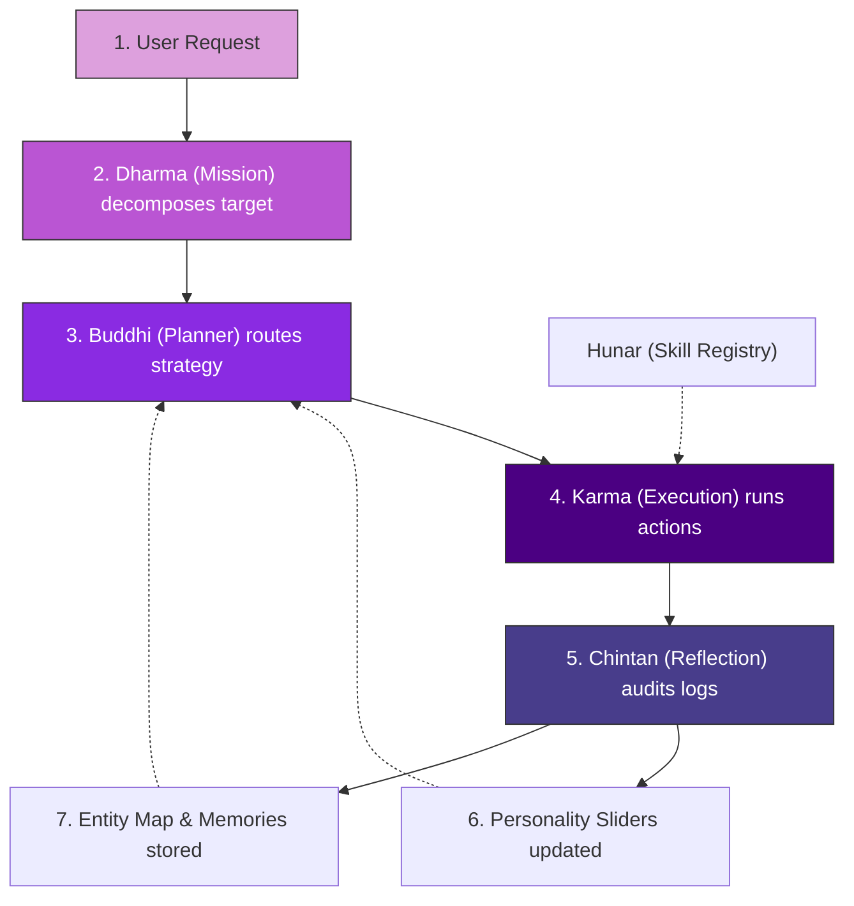

# Brahma Core System & Execution Workflow

```yaml
id: WORKFLOW
version: 1.0.0
last_sync: 2026-05-31T00:06:42+05:30
agent_permission: READ-ONLY
description: "Core execution cycle, token-saving prompt strategies, and multi-agent coordination pipeline."
```

---

## 1. The Core System Architecture ("The Brahma Loop")

The Brahma architecture operates as a **closed-loop feedback system**. Rather than relying on a single large prompt, the framework partitions cognitive functions across specialized files, enabling lean, parallelizable agent actions.



---

## 2. Phase-by-Phase Execution Pipeline

### Phase A: Strategic Synthesis (Planning)
1. **Intake**: A user inputs a high-level goal.
2. **Decomposition**: The **Planner Agent** reads the directive and updates [Dharma.md](file:///h:/Brahma/Brahma%20%5BBrain%5D/Dharma.md), generating the next high-level Mission ID (`M-XXX`) and dividing it into atomic sub-tasks (`M-XXX-01`, `M-XXX-02`...).
3. **Context Hydration**: The Planner queries [Zehn.md](file:///h:/Brahma/Brahma%20%5BBrain%5D/Zehn.md) to locate relevant entities (`E-XXX`) or daily historical logs (`memory/YYYY-MM-DD.md`) related to the task, completely bypassing unrelated history.
4. **Strategy Mapping**: The Planner updates [Buddhi.md](file:///h:/Brahma/Brahma%20%5BBrain%5D/Buddhi.md), logging the strategy, identifying risks, mapping mitigations, and routing sub-tasks to specific Skill IDs (`S-XXX`) in the [Hunar.md](file:///h:/Brahma/Brahma%20%5BBrain%5D/Hunar.md) registry.

### Phase B: Tactical Execution (Action)
1. **Dispatch**: The **Executor Agent** loads [Buddhi.md](file:///h:/Brahma/Brahma%20%5BBrain%5D/Buddhi.md) and [Hunar.md](file:///h:/Brahma/Brahma%20%5BBrain%5D/Hunar.md).
2. **Atomic Action**: The Executor runs individual commands or tools as dictated by the skill sheets (e.g. [skills/template.md](file:///h:/Brahma/Brahma%20%5BBrain%5D/skills/template.md)).
3. **Trace Log**: Immediately after each operation, the Executor logs an action row (`K-XXX`) in [Karma.md](file:///h:/Brahma/Brahma%20%5BBrain%5D/Karma.md) detailing inputs, outputs, status (`SUCCESS` / `FAILED`), and links back to the sub-task ID.

### Phase C: Cognitive Integration (Reflection & Decay)
1. **Self-Audit**: The **Reflection Agent** compares the action trace in [Karma.md](file:///h:/Brahma/Brahma%20%5BBrain%5D/Karma.md) against the sub-tasks in [Dharma.md](file:///h:/Brahma/Brahma%20%5BBrain%5D/Dharma.md).
2. **Learning Database**: The Agent logs successes, failures, or linter errors into [Chintan.md](file:///h:/Brahma/Brahma%20%5BBrain%5D/Chintan.md) (`L-XXX`).
3. **Behavioral Update**: If conversational alignment issues are identified, the Agent adjusts parameters in [Atman.md](file:///h:/Brahma/Brahma%20%5BBrain%5D/Atman.md) (personality sliders) or issues optimization tickets (`T-XXX`).
4. **Decay & Rollup**: If `Karma.md` entries exceed 20 rows, the Agent compresses them into a high-density, 3-sentence summary in a new daily memory file under `memory/`, registers the file link in `Zehn.md`, and trims the raw logs in `Karma.md`.

---

## 3. High-Efficiency Token-Saving Prompting Rules

To run Brahma continuously on LLMs without exhausting context windows or incurring heavy costs, follow these prompt pruning guidelines:

| Target Query Type | Files to Load (Hydration Scope) | Files to IGNORE | Rationale |
| :--- | :--- | :--- | :--- |
| **New Goal Input** | `Dharma.md` | `Karma.md`, `skills/`, `memory/` | The planner only needs to know the mission board state to write new tasks. |
| **Task Planning** | `Dharma.md`, `Buddhi.md`, `Zehn.md` | `Atman.md`, `Chintan.md` | The planner needs context index maps and strategies, not personality traits. |
| **Action Execution** | `Buddhi.md`, `Karma.md`, `Hunar.md` | `Chintan.md`, `memory/` | The executor only needs active strategies, action logs, and skill code rules. |
| **Reflective Review**| `Dharma.md`, `Karma.md`, `Chintan.md` | `Hunar.md`, `skills/` | The analyzer only compares planned targets vs executed atomic outputs. |

### The Alphanumeric Index Constraint
> [!TIP]
> Never prompt an agent with verbose system descriptions. Instead, instruct the agent: 
> *"Use Entity ID `E-002` (Atman) and Skill ID `S-001` to execute sub-task `M-001-03`."*
> This reduces standard prompt lengths by up to **75%**, dramatically saving token consumption.

---

## 4. Multi-Agent Orchestration Flow (Parallel Execution)

Brahma allows multiple agents to execute concurrently by defining clear boundaries based on file locks and states.

```
                  ┌────────────────────────────────────────┐
                  │              PLANNER AGENT             │
                  │  Reads: Dharma, Zehn  Writes: Buddhi   │
                  └───────────────────┬────────────────────┘
                                      │
                                      ▼
                  ┌────────────────────────────────────────┐
                  │             EXECUTOR AGENT             │
                  │  Reads: Buddhi, Hunar Writes: Karma   │
                  └───────────────────┬────────────────────┘
                                      │
                                      ▼
                  ┌────────────────────────────────────────┐
                  │            REFLECTION AGENT            │
                  │  Reads: Karma, Dharma Writes: Chintan  │
                  └────────────────────────────────────────┘
```

* **Planner Agent**: Locked on file write permissions for `Dharma.md` and `Buddhi.md`.
* **Executor Agent**: Locked on file write permissions for `Karma.md` and workspace code outputs (e.g. backend/frontend files).
* **Reflection Agent**: Locked on file write permissions for `Chintan.md`, `Zehn.md`, and `Atman.md`.

This structure avoids write conflicts, enables modular agents to run asynchronously, and ensures consistent state tracing across the entire codebase.
